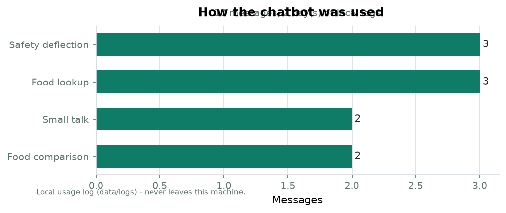

# Usage report - NutriCoach T2D

*Generated by `usage_analysis.py` on 2026-08-27 from the local log (`data/logs/`, 2 day(s): 2026-08-26 to 2026-08-27).*

**Total messages: 10**

| Category | Messages | Share |
|---|---|---|
| Food lookup | 3 | 30% |
| Food comparison | 2 | 20% |
| Safety deflection | 3 | 30% |
| Small talk | 2 | 20% |

* **Fallback rate: 0.0%** - share of messages the bot could not route. This is the key real-world coverage metric (proposal §6, limitation 2).
* **Safety rate: 30.0%** - messages deflected to human care as designed.

## Knowledge-base gaps (distinct fallback utterances)

None recorded - no message has hit the fallback yet.

